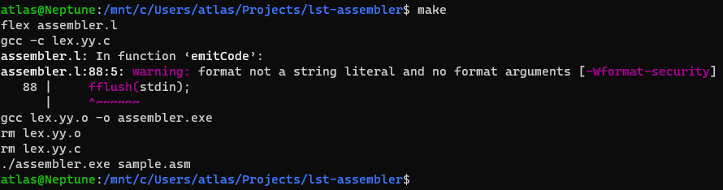

# lst-assembler

## Requirements

- Linux base system or WSL for Windows
- Make
- Flex 
- GCC

If you don't have any of the above, run the following commands:

```
sudo apt update
sudo apt install make
sudo apt install flex
```

## Running the proyect

1. In the terminal go to the root of the project, for example:
   - **c\Users\UserName\Projects\lst-assembler**
2. Run the makefile using the command `make`, you will get and output like this one:
   
4. The output file will appear with the named **out.bin**